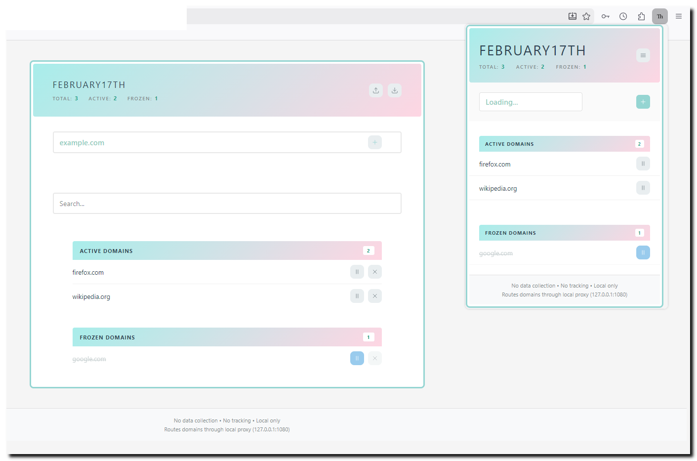

# FEBRUARY17TH

&nbsp;
  

*A Firefox extension for managing domain-based proxy routing through your local SOCKS5 proxy. This extension requires a local SOCKS5 proxy server. The extension itself does not provide proxy functionality - it only manages which domains route through your existing proxy. "February17th" lets you selectively route specific websites through your local SOCKS5 proxy (127.0.0.1:1080). For development testing.*

&nbsp;

&nbsp;

&nbsp;
## Features

### Core Functionality

- **One-click domain addition** - Add current site directly from the toolbar popup
- **Subdomain support** - Add `example.com` and all subdomains route automatically
- **Freeze/unfreeze domains** - Temporarily disable proxy without removing domains
- **Selective routing** - Only specified domains use proxy, rest go direct

&nbsp;

### Smart Organization

- **Alphabetical sorting** - Domains always displayed A→Z for easy navigation
- **Status grouping** - Active and frozen domains in separate sections with counts
- **Real-time statistics** - Track total, active, and frozen domains at a glance
- **Visual indicators** - Clear status with color coding and icons

&nbsp;

### Data Management

- **Smart export** - Dated filenames (YYYY-MM-DD) for easy backup management
- **Bulk import** - Import up to 5,000 domains from text file
- **Search & filter** - Quickly find domains in large lists
- **Real-time sync** - Changes in popup instantly reflect in settings page

&nbsp;

### User Experience

- **Modern interface** - Clean, gradient design with smooth animations
- **Ultra-thin scrollbars** - 4px scrollbars that match the theme
- **Hover tooltips** - Helpful hints on all buttons
- **Auto-validation** - Invalid domains rejected with clear error messages
- **Responsive design** - Works smoothly with 100+ domains

&nbsp;

### Privacy & Security

- **Zero data collection** - No analytics, no tracking, no telemetry
- **Local storage only** - Domain list never leaves your device
- **No external connections** - Completely offline operation
- **Strict input validation** - Protection against malformed domains and XSS
- **Content Security Policy** - Maximum security hardening
- **Open source** - All code is auditable

&nbsp;

### Performance

- **Lightweight** - No external dependencies, pure JavaScript
- **Fast routing** - Instant proxy decisions with efficient domain matching
- **No slowdown** - Handles 5,000 domains without performance impact
- **Minimal permissions** - Only requests what's absolutely necessary

&nbsp;

## Installation

### From Firefox Add-ons (Recommended)

*Coming soon - pending Mozilla review*

&nbsp;

### Manual Installation (Development)

1. Download or clone this repository
2. Open Firefox and navigate to `about:debugging#/runtime/this-firefox`
3. Click "Load Temporary Add-on"
4. Select `manifest.json` from the extension folder
5. The extension icon will appear in your toolbar

&nbsp;

## Requirements

- **Firefox 57+** (Manifest V2)  
- **Local SOCKS5 proxy** running on `127.0.0.1:1080`  
  - SSH tunnel: `ssh -D 1080 user@server`  
  - Shadowsocks, or any SOCKS5 proxy   

&nbsp;

## Usage

### Quick Add

1. Visit any website
2. Click the extension icon in toolbar
3. Domain auto-fills from current tab
4. Click "add" button
5. Refresh the page (F5)
6. Site now routes through your proxy

&nbsp;

### Manage Domains

1. Click the settings icon (☰) in the popup
2. Add domains manually
3. Search through your domain list
4. Freeze domains to temporarily disable proxy
5. Export/import domain lists for backup

&nbsp;

## Screenshots

*Screenshots will be added after final release*

&nbsp;

## Privacy & Security

- **Zero data collection** - No analytics, no tracking
- **Local storage only** - Domain list never leaves your device
- **No external connections** - Completely offline operation
- **Open source** - All code is auditable
- **Strict input validation** - Protection against malformed domains
- **Content Security Policy** - Maximum security hardening

See [SECURITY.md](01_md/SECURITY.md) for detailed security information.

&nbsp;

## Documentation

- [SECURITY.md](01_md/SECURITY.md) - Privacy policy and security details
- [HOW-IT-WORKS.md](01_md/HOW-IT-WORKS.md) - Technical architecture
- [TESTING.md](01_md/TESTING.md) - Testing guide

&nbsp;

## Technical Details

### Architecture

- **Manifest V2** (Firefox-compatible)
- **Permissions**: proxy, storage, activeTab, <all_urls>
- **Proxy**: SOCKS5 to localhost only (127.0.0.1:1080)
- **Storage**: Browser local storage API

&nbsp;

### Domain Validation

- ASCII-only domains (a-z, 0-9, hyphens)
- Minimum 2 labels required (e.g., example.com)
- Maximum 253 characters per domain
- Prevents homograph attacks by blocking IDN/punycode

&nbsp;

### Limitations

- Does not support Internationalized Domain Names (IDN)
- Requires local SOCKS5 proxy (not included)
- Firefox only (Chrome/Edge not supported)

&nbsp;

## Development

### Project Structure

```
february17th/
february17th-main/
│
├── 01_md/                          # Documentation files
│   ├── AMO_REVIEW_NOTES.md
│   ├── CHANGELOG.md
│   ├── CONTRIBUTING.md
│   ├── HOW-IT-WORKS.md
│   ├── SECURITY.md
│   └── TESTING.md
│
├── 02_html/                        # HTML pages
│   ├── options.html
│   └── popup.html
│
├── 03_css/                         # Stylesheets
│   ├── options.css
│   └── popup.css
│
├── 04_js/                          # JavaScript files
│   ├── background.js
│   ├── options.js
│   └── popup.js
│
├── 05_json/                        # Configuration files
│   └── manifest.json
│
├── 06_ico/                         # Icons and images
│   ├── 1.png
│   ├── icon-16.png
│   ├── icon-32.png
│   ├── icon-48.png
│   ├── icon-64.png
│   ├── icon-96.png
│   └── icon-128.png
│
└── README.md                       # Main documentation

```

&nbsp;

### Building

No build process required - pure JavaScript.

To create distribution package:

```bash
zip -r february17th-v1.0.0.zip manifest.json background.js popup.* options.* ico/ *.md
```

## Roadmap

- [ ] Manifest V3 migration (when Firefox proxy API ready)
- [ ] Domain groups/categories
- [ ] Per-domain proxy configuration
- [ ] Import from browser bookmarks
- [ ] Dark theme support

&nbsp;

---


