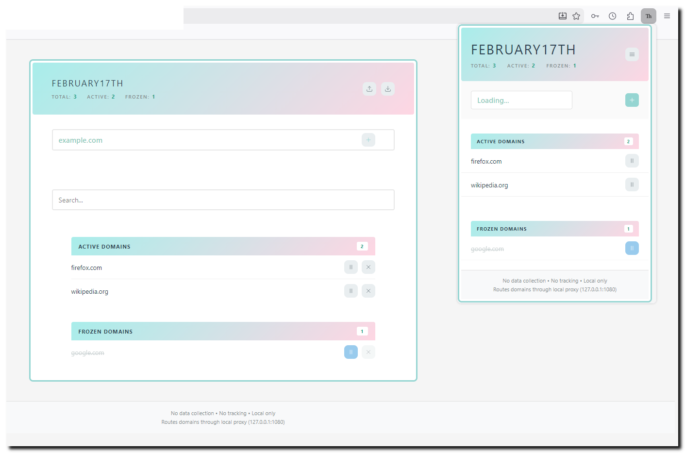

# FEBRUARY17TH

&nbsp;
  

*A Firefox extension for managing domain-based proxy routing through your local SOCKS5 proxy. This extension requires a local SOCKS5 proxy server. The extension itself does not provide proxy functionality - it only manages which domains route through your existing proxy. "February17th" lets you selectively route specific websites through your local SOCKS5 proxy (127.0.0.1:1080).  
For development testing.*

&nbsp;

&nbsp;

&nbsp;
## Features

### Core Functionality

- **One-click domain addition** - Add current site directly from the toolbar popup
- **Subdomain support** - Add `example.com` and all subdomains route automatically
- **Freeze/unfreeze domains** - Temporarily disable proxy without removing domains
- **Selective routing** - Only specified domains use proxy, rest go direct

&nbsp;

### Smart Organization

- **Alphabetical sorting** - Domains always displayed A→Z for easy navigation
- **Status grouping** - Active and frozen domains in separate sections with counts
- **Real-time statistics** - Track total, active, and frozen domains at a glance
- **Visual indicators** - Clear status with color coding and icons

&nbsp;

### Data Management

- **Smart export** - Dated filenames (YYYY-MM-DD) for easy backup management
- **Bulk import** - Import up to 5,000 domains from text file
- **Search & filter** - Quickly find domains in large lists
- **Real-time sync** - Changes in popup instantly reflect in settings page

&nbsp;

### User Experience

- **Modern interface** - Clean, gradient design with smooth animations
- **Ultra-thin scrollbars** - 4px scrollbars that match the theme
- **Hover tooltips** - Helpful hints on all buttons
- **Auto-validation** - Invalid domains rejected with clear error messages
- **Responsive design** - Works smoothly with 100+ domains

&nbsp;

### Privacy & Security

- **Zero data collection** - No analytics, no tracking, no telemetry
- **Local storage only** - Domain list never leaves your device
- **No external connections** - Completely offline operation
- **Strict input validation** - Protection against malformed domains and XSS
- **Content Security Policy** - Maximum security hardening
- **Open source** - All code is auditable

&nbsp;

### Performance

- **Lightweight** - No external dependencies, pure JavaScript
- **Fast routing** - Instant proxy decisions with efficient domain matching
- **No slowdown** - Handles 5,000 domains without performance impact
- **Minimal permissions** - Only requests what's absolutely necessary

&nbsp;

## Version 2.0.0 - Sidebar Panel

**New in v2.0.0:**

- **Persistent sidebar panel** - Full-featured management in Firefox's left sidebar
- **Three access modes** - Popup (quick add), Sidebar (full management), Options page (spacious view)
- **Optimized layout** - Sidebar designed for vertical space with fixed inputs and scrollable lists
- **Individual list scrolling** - Active domains (7 visible) and frozen domains (4 visible) scroll independently
- **Same functionality** - Add, search, freeze, delete, export/import available in all views

The sidebar provides persistent access to all extension features without opening new tabs. Pin it to the left sidebar for always-on domain management while browsing.

&nbsp;

## Installation

### For Users (Permanent Installation)

**[📥 Download february17th v2.0.0](https://github.com/414962002/february17th/releases/download/v2.0.0/february17th-2.0.0.xpi)**

Click the link above, Firefox will prompt you to install the extension.

**Alternative:**
- Visit the [Releases page](https://github.com/414962002/february17th/releases)
- Download `february17th-2.0.0.xpi`
- Drag and drop into Firefox

&nbsp;

### For Developers (Temporary Installation)

⚠️ **Warning:** This method loads unsigned code. The extension will be removed when Firefox restarts.

1. Clone this repository
2. Open Firefox and navigate to `about:debugging#/runtime/this-firefox`
3. Click "Load Temporary Add-on"
4. Select `manifest.json` from the extension folder
5. Extension will be removed on Firefox restart

**For permanent installation, use the signed .xpi file above.**

&nbsp;

## Requirements

- **Firefox 142.0+** (for signed version)  
- **Local SOCKS5 proxy** running on `127.0.0.1:1080`  
  - SSH tunnel: `ssh -D 1080 user@server`  
  - Shadowsocks, or any SOCKS5 proxy  


&nbsp;

## Usage

### Quick Add

1. Visit any website
2. Click the extension icon in toolbar
3. Domain auto-fills from current tab
4. Click "add" button
5. Refresh the page (F5)
6. Site now routes through your proxy

&nbsp;

### Manage Domains

1. Click the settings icon (☰) in the popup
2. Add domains manually
3. Search through your domain list
4. Freeze domains to temporarily disable proxy
5. Export/import domain lists for backup

&nbsp;

## Privacy & Security

- **Zero data collection** - No analytics, no tracking
- **Local storage only** - Domain list never leaves your device
- **No external connections** - Completely offline operation
- **Open source** - All code is auditable
- **Strict input validation** - Protection against malformed domains
- **Content Security Policy** - Maximum security hardening

See [SECURITY.md](note/SECURITY.md) for detailed security information.

&nbsp;

## Documentation

- [SECURITY.md](note/SECURITY.md) - Privacy policy and security details
- [HOW-IT-WORKS.md](note/HOW-IT-WORKS.md) - Technical architecture
- [TESTING.md](note/TESTING.md) - Testing guide

&nbsp;

## Technical Details

### Architecture

- **Manifest V2** (Firefox-compatible)
- **Permissions**: proxy, storage, activeTab, <all_urls>
- **Proxy**: SOCKS5 to localhost only (127.0.0.1:1080)
- **Storage**: Browser local storage API

&nbsp;

### Domain Validation

- ASCII-only domains (a-z, 0-9, hyphens)
- Minimum 2 labels required (e.g., example.com)
- Maximum 253 characters per domain
- Prevents homograph attacks by blocking IDN/punycode

&nbsp;

### Limitations

- Does not support Internationalized Domain Names (IDN)
- Requires local SOCKS5 proxy (not included)
- Firefox only (Chrome/Edge not supported)

&nbsp;

## Development

### Project Structure

Official Mozilla WebExtension structure:

```
february17th/
├── manifest.json                   # Extension configuration
├── background.js                   # Proxy handler & domain management
├── popup.html                      # Browser action popup
├── popup.js                        # Popup logic
├── popup.css                       # Popup styles
├── sidebar.html                    # Sidebar panel
├── sidebar.js                      # Sidebar logic
├── sidebar.css                     # Sidebar styles
├── options.html                    # Settings page
├── options.js                      # Settings logic
├── options.css                     # Settings styles
├── ico/                            # Icons folder
│   ├── icon-16.png
│   ├── icon-32.png
│   ├── icon-48.png
│   ├── icon-64.png
│   ├── icon-96.png
│   ├── icon-128.png
│   └── 1.png
├── note/                           # Documentation
│   ├── HOW-IT-WORKS.md
│   ├── SECURITY.md
│   ├── TESTING.md
│   └── CHANGELOG.md
└── README.md
```

&nbsp;

### Building & Packaging

No build process required - pure JavaScript.

**For Firefox submission:**

```bash
# Create distribution package
zip -r february17th-v2.0.0.zip .
```

**For temporary testing in Firefox:**

1. Open `about:debugging#/runtime/this-firefox`
2. Click "Load Temporary Add-on"
3. Select `manifest.json` from the extension folder
4. Test the extension

&nbsp;

---

2026

